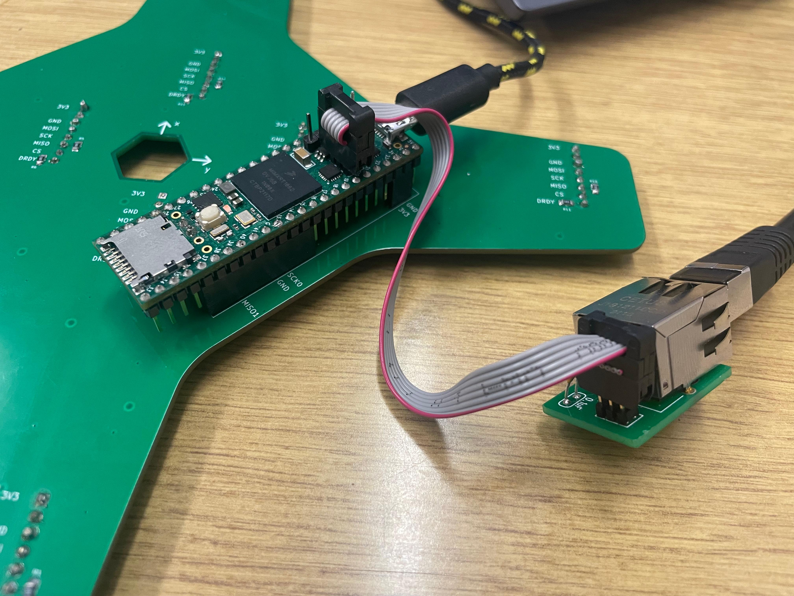

# sriod_ros_publisher
ROS1 publisher for sriod sensor. 

Sensor was made by dr.-ing. Dean Martinovic.
### Instructions 

1. Clone repository to your workspace and build it.
2. Connect the sensor as shown.

    
3. Setup your wired network settings. You need to manually set IPv4 settings as is written in `./source/sriod_publisher_node.cpp` in `LOCAL_ADDRESS` and `REMOTE_ADDRESS` variables. By default it is:
    - Address: 192.168.0.2
    - Netmask: 255.255.255.0
    - Gateway: 192.168.0.1
4. Refresh your network connection (turn off then turn on wired connection).
5. To start getting measurements from sriod sensor:
    ```bash
    roslaunch sriod_ros_publisher sriod_ros_publisher.launch
    ```
6. Measurements topic is `/sriod_data`.

For those who want to cite this project, you can use the following BibTeX entry:
```bibtex
@article{martinovic2023object,
  title={Object localization by construction of an asymmetric isobody of the magnetic gradient tensor contraction using two identical permanent magnets},
  author={Martinovi{\'c}, Dean and Vuleti{\'c}, Jelena and Stuhne, Dario and Orsag, Matko and Kova{\v{c}}i{\'c}, Zdenko},
  journal={IEEE transactions on magnetics},
  volume={59},
  number={4},
  pages={1--9},
  year={2023},
  publisher={IEEE}
}
```
